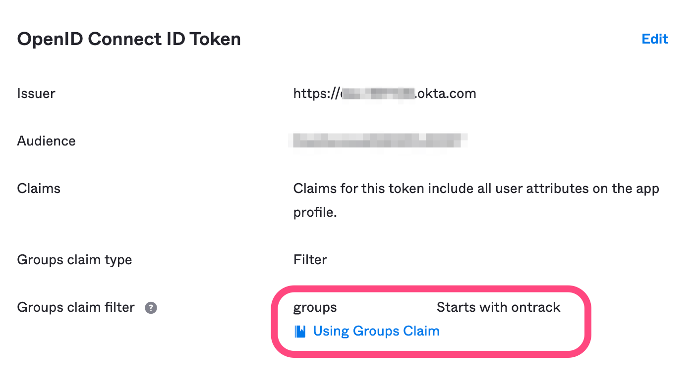

Ontrack Helm Chart
==================

This Helm chart is compatible with Helm 3 and allows the installation of Ontrack in a Kubernetes cluster.

# Usage

[Helm](https://helm.sh) must be installed to use the charts.  Please refer to
Helm's [documentation](https://helm.sh/docs) to get started.

The Yontrack Helm chart is available as an OCI Helm chart in Docker Hub.

```
helm install yontrack oci://registry-1.docker.io/nemerosa/yontrack-chart
```

To uninstall the chart:

```
helm delete yontrack
```

This installs the following services:

* Ontrack itself
* a Postgres 17 database
* an Elasticsearch 7 single node
* a RabbitMQ message broker

The default authentication mechanism, if no other configuration is provided, relies on Keycloak
and its own database and two additional services are installed:

* a Keycloak instance configured for storing users
* a Postgres 17 database for Keycloak

> Other authentication options are available. See [authentication](#authentication) below.

# References

See [`charts/ontrack/README.md`](charts/ontrack/README.md) for
the list of all values.

# License key

By default, Yontrack comes with a limited license key, suitable only for evaluation purposes.

When you buy a license key, you have to set it in your configuration:

```yaml
ontrack:
  config:
    license:
      key: "your license key"
```

# Ingress configuration

> The ingress configuration is _required_ if using the default Keycloak setup.

The minimal setup looks like:

```yaml
ontrack:
  url: "https://<host>>"
ingress:
  enabled: true
  annotations:
    # kubernetes.io/ingress.class: nginx
    # cert-manager.io/cluster-issuer: letsencrypt-prod
  host: <host>
```

The following URLs are available:

* `<host>` - the main Ontrack URL to access its UI
* `<host>/graphql` - access to the Ontrack GraphQL API
* `<host>/keycloak` - if the default Keycloak setup is enabled, access to the admin console of Keycloak

# Authentication

By default, the Ontrack Helm chart sets up an instance of Keycloak, configured to store users for Ontrack.

## Default local Keycloak instance

Given the values provided for the [ingress](#ingress-configuration), you just run:

```bash
helm upgrade --install --values values.yaml ontrack ontrack/ontrack
```

By default,

* the Keycloak admin user is set to `admin` / `admin`
* one user is provisioned in the `ontrack` realm of Keycloak:
  * name: `admin`
  * email: `admin@ontrack.local`
  * password: `admin`

### Configuration of the access to Keycloak

By default, the Keycloak instance is accessible on `<ontrack>/keycloak`.

If this is not wished for, you can disable its exposure using:

```yaml
auth:
  keycloak:
    service:
      ingressEnabled: false
```

### Configuration of the Keycloak client ID and secret

When using Keycloak as the authentication source, the OIDC client ID
and secret can be defined in different ways.

#### Client ID and secret in values

The default way is to store the OIDC client ID and secret directly
into the values:

```yaml
auth:
  keycloak:
    client:
      id: ontrack-client
      secret: ontrack-client-secret
```

> Do not use this in production since it would expose your client
> credentials through the Helm values.

#### Client ID and secret in a secret

You can store the client ID and secret into a K8S secret:

```yaml
auth:
  keycloak:
    secret:
      enabled: true
      name: ontrack-keycloak
```

The secret must:

* exist so that Keycloak can start
* have two keys: `id` and `secret` to respectively store the client ID and secret

#### Client ID and secret generation

Like before, but you tell the chart to _generate_ the secret before hand.

```yaml
auth:
  keycloak:
    secret:
      enabled: true
      name: ontrack-keycloak
      generate: true
```

The client ID and secrets are automatically generated and used by the 
Ontrack UI client.

If need be, their values can be accessed by reading the secret.

### Configuration of the Keycloak bootstrap administrator

The default admin credentials of Keycloak are set to `admin/admin`.

Several options are available to secure these credentials.

#### Changing the credentials in the values

> While OK for testing, this is not secure in a real environment.

You can change the credentials:

```yaml
auth:
  keycloak:
    bootstrap:
      username: admin
      password: admin
```

#### Setting the credentials in a secret

You can create a secret with two keys: `username` and `password`.

The name of the secret is configurable:

```yaml
auth:
  keycloak:
    bootstrap:
      bootstrapSecret:
        enabled: true
        secretName: ontrack-keycloak-bootstrap
```

#### Generation of a secret

You can tell the chart  generate the secret:

```yaml
auth:
  keycloak:
    bootstrap:
      bootstrapSecret:
        enabled: true
        generate: true
        secretName: ontrack-keycloak-bootstrap
```

In this case, you don't have to provide the secret yourself. It'll be generated upon the installation
of the Helm release and will contain the credentials in the `username` and `password` keys.

> Note that the `username` is not generated and taken from `auth.keycloak.bootstrap.username`, which
> defaults to `admin`.

> You'll need to read the secret in Kubernetes to know the credentials to use to connect to Bootstrap.

#### Using an external secret

A more secure option, if your cluster supports this, is to use an external secret.

You can then tell the chart to create an `ExternalSecret` and the actual secret will be generated. For example:

```yaml
auth:
  keycloak:
    bootstrap:
      bootstrapSecret:
        enabled: true
        secretName: your-secret
        externalSecret:
          enabled: true
          store:
            name: vault-backend
            kind: ClusterSecretStore
            path: ontrack/test/v5/keycloak
```

## OIDC for Okta

Ontrack can bypass the Keycloak component altogether and use your own OIDC IdP.

The configuration below works for Okta, but a setup of [Auth0](#oidc-for-auth0) is provided after.

The following values are needed:

```yaml
ontrack:
  # Ontrack root URL
  url: https://****
auth:
  # Key used for the generation of cookies by the Next Auth frontend
  secret: <openssl rand -hex 32>
  oidc:
    # Enabling OIDC authentication
    enabled: true
    # Display name for your IdP (used for the login page)
    name: <display name for the provider>
    # OIDC issuer URL
    issuer: https://****.okta.com
    # Credentials used to contact the OIDC provider
    credentials:
      # Either stored in a secret (recommended)
      secret:
        # Using a secret
        enabled: true
        # The secret is expected to have the following keys: clientId & clientSecret
        secretName: <secret name>
        # Depending on your setup, you can also just create an external secret
        # definition, pointing to the actual secret in a secret provided like
        # Vault or your cloud secret manager
        # If not using an external secret, Ontrack expects you to create the 
        # secret manually.
        # externalSecret:
          # Enabling the creation of the external secret 
          # enabled: false
          # Refresh interval
          # refreshInterval: 6h
          # Location of the secret to bind to
          # store:
            # Name of the secret store
            # name: vault-backend
            # Scope of the secret store
            # kind: ClusterSecretStore
            # Path to the secret in the store.
            # The entry is expected to have the following keys: clientId & clientSecret
            # path: ontrack/oidc
      # ... or provided directly in the values (ok for testing)
      # If a secret (or external secret) is provided, these values are not used
      # clientId: <client id>
      # clientSecret: <client secret>
  keycloak:
    # Disabling Keycloak altogether
    enabled: false
  # Okta specifics: the JWT emitted by this IdP is not fully OIDC compliant
  jwt:
    # The `typ` attribute emitted by Okta does is not the expected "JWT" value
    typ: application/okta-internal-at+jwt
    # The email in the access token is contained in the `sub` claim
    claims:
      email: sub
```

## OIDC for Auth0

If you're using Auth0 as an OIDC provider, the setup is slightly more complex.

See the dedicated documentation at [`auth0`](docs/auth0.md).

## LDAP

The local Keycloak instance can be configured to use an external LDAP for the management of the Ontrack users:

* Keycloak acts as a proxy
* Keycloak is in read-only mode for the target LDAP (users can be accessed and used for authentication, but not updated)

Use the following values, at a minimum:

```yaml
auth:
  keycloak:
    settings:
      enabled: false
    ldap:
      enabled: true
      url: <url to the LDAP>
      usersDn: ou=users,dc=example,dc=com
      bindDn: cn=admin,dc=example,dc=com
      bindCredential: admin
```

There are other [options](charts/ontrack/values.yaml) to configure the mapping of the user fields
in the LDAP to the ones that Keycloak expects. The default mappings are suitable for OpenLDAP.

Ontrack uses Keycloak as a relay to the LDAP, so attention must be given to the settings of 
Keycloak as well, in terms of security.

### Using a secret for the LDAP credentials

Using the `bindDn` and `bindCredential` value is not recommended to store the credentials to connect
to the LDAP.

You can use an existing secret by using:

```yaml
auth:
  keycloak:
    ldap:
      bindCredentialSecret:
        enabled: true
        secretName: ontrack-ldap-credentials
```

You can also create an external secret definition to point to your secret store:

```yaml
auth:
  keycloak:
    ldap:
      bindCredentialSecret:
        enabled: true
        externalSecret:
          enabled: true
          refreshInterval: 6h
          store:
            name: vault-backend
            kind: ClusterSecretStore
            path: ontrack/test/v5/ldap
```

### Keycloak LDAP configuration

Values under `auth.keycloak.ldap` can be used to configure the LDAP settings in Keycloak:

```yaml
auth:
  keycloak:
    ldap:
      # -- LDAP attributes: username
      usernameLDAPAttribute: uid
      # -- LDAP attributes: DN
      rdnLDAPAttribute: uid
      # -- LDAP attributes: unique ID
      uuidLDAPAttribute: entryUUID
      # -- LDAP attributes: class for the user object
      userObjectClasses: inetOrgPerson
```

If you need more control on the mapping attributes, you can override the `components` node
of the Keycloak configuration:

```yaml
auth:
  keycloak:
    ldap:
      components:
         # Your config here
```

> See the [values](charts/ontrack/values.yaml) for more information.

## Management of users in Ontrack

For any user connecting to Ontrack through any authentication provider, upon login,
an account is created in Ontrack to hold their authorizations and relationships
to objects in Ontrack. Are stored:

* their username
* their email
* their full name (if available, defaults to the email)

If the `auth.provisioning` is set to `true` (that's the default), a default group
is created with the name "Administrators", with all the rights to administrate Ontrack.

For any user logging with the email defined at `auth.admin.email` (defaults to `admin@ontrack.local`
but should be changed), the account created for this user will be linked automatically
to the "Administrators" group.

In short, to designate which user is the super admin, set the following values:

```yaml
auth:
  admin:
    email: <email of the super user>
```

## Logging authentication

If you face troubles with the authentication, you can add some logging instructions:

```yaml
ontrack:
  config:
    security:
      authorization:
        jwt:
          debug:true
```

## Next Auth secret

The Next Auth secret used to generate cookies on the client side
is automatically generated.

In case more control is needed (like reusing an existing secret),
you can tune its configuration using:

```yaml
auth:
  next:
    secret:
      name: ontrack-next-auth
      generate: true
```

## Configuration of groups

If groups set in the IdP are passed in the `groups` claim of the JWT access token, Yontrack
has access to them, and they can be mapped to actual Yontrack groups to grant authorisations
to groups of people belonging to same group.

The way to setup the groups depend on the IdP you are using.

### Keycloak database

You just need to configure the users and the groups directly in Keycloak.

> The `groups` claim is automatically configured to be injected into the JWT access token.

### LDAP in Keycloak

When an external LDAP is enabled in Keycloak, you need to configure how the LDAP groups are detected
by Keycloak.

The mapping defaults to:

```yaml
auth:
  keycloak:
    ldap:
      groups:
        # -- Groups DN
        groupsDn: "ou=groups,dc=example,dc=com"
        membershipAttributeType: DN
        membershipUserLdapAttribute: uid
        membershipLdapAttribute: member
        memberofLdapAttribute: memberOf
        groupNameLdapAttribute: cn
        groupObjectClasses: groupOfNames
```

> The `groups` claim is automatically configured to be injected into the JWT access token.

### Okta

If you want to use Okta groups in the group mappings in Yontrack, go to _Sign On_ section of
the application and make sure to select a list of groups (using a filter):



# Using a managed database

In order to use a managed database, create a values file and fill the URL and credentials to access the database:

```yaml
postgresql:
  local: false
  auth:
    username: ontrack
    password: "*****"
  postgresqlUrl: "jdbc:postgresql://<host>:<port>/ontrack?sslmode=require"
```

Then, run the installation using this values file:

```bash
helm install -f values.yaml my-ontrack-release ontrack/ontrack
```

The setup of the Postgres service will be skipped and Ontrack will be configured to use the remote database.

Alternatively, if your connection parameters are in environment variables, you can skip this configuration altogether:

```yaml
postgresql:
  local: false
  postgresFromEnv: true
```

This requires the following environmment variables to be set:

* `SPRING_DATASOURCE_URL` - complete JDBC URL, like `jdbc:postgresql://<host>:<port>/ontrack?sslmode=require`
* `SPRING_DATASOURCE_USERNAME` - username for the connection
* `SPRING_DATASOURCE_PASSWORD` - password for the connection

# Configuration as code (CasC)

Casc is not enabled by default in the chart. To enabled it, use the following values:

```yaml
ontrack:
  casc:
    enabled: true
```

Casc can take its values from a configuration map and/or a secret:

```yaml
ontrack:
  casc:
    enabled: true
    map: some-config-map-name
    secret: some-secret-name
```

Both must contain entries called `<any-name>.yaml` containing some YAML Casc code.

## Secrets mappings

Casc files can contain `{{ secret.name.property }}` which are extrapolated using environment variables or secret files.

### Using environment variables

The default behaviour is to use environment variables. The name of the environment variable to consider is: `SECRET_<NAME>_<PROPERTY>`.

For example, if YAML Casc fragment contains:

```yaml
ontrack:
  config:
    github:
      - name: github.com
        token: {{ secret.github.token }}
```

Given a `ontrack-github` K8S secret containing the secret token in its `token` property, you can just set the following values for the chart:

```yaml
ontrack:
  casc:
    enabled: true
    map: some-config-map-name
  env:
    - name: SECRET_GITHUB_TOKEN
      valueFrom:
        secretKeyRef:
          name: "ontrack-github"
          key: "token"
```

### Using secret files

Instead of using environment variables, you can also map secrets to files and tell Ontrack to refer to the secrets in the files.

Given the example above:

```yaml
ontrack:
  config:
    github:
      - name: github.com
        token: {{ secret.github.token }}
```

You can map the `ontrack-github` K8S secret onto a volume and tell Ontrack to use this volume:

```yaml
ontrack:
  casc:
    enabled: true
    map: some-config-map-name
    secrets:
      type: file
      names:
        - ontrack-github
# TODO Volumes & volume mounts
```

# Using a K8S secret for the encryption keys

Ontrack encrypts the credentials used to connect to external systems, using an AES256 key.

This key is by default stored into the database itself, which is OK to get started, but this has two issues:

* it's not very secure since the key used to encrypts credentials in the database is stored in the database
* when migrating an Ontrack installation from a file store, it's not easy to migrate

When using the Ontrack Helm chart, you can use a K8S secret to store this encryption key.

There are two scenarios.

## Generating the secrets from scratch (new installation)

````bash
openssl rand 256 > net.nemerosa.ontrack.security.EncryptionServiceImpl.encryption
````

## Copying the secrets (existing installation)

To get the existing key from Ontrack, use:

```bash
# For Ontrack V4
curl --user admin https://<ontrack>/rest/admin/encryption | base64 -d > net.nemerosa.ontrack.security.EncryptionServiceImpl.encryption
# For Ontrack V3
curl --user admin https://<ontrack>/admin/encryption | base64 -d > net.nemerosa.ontrack.security.EncryptionServiceImpl.encryption
```

In both cases (V3 & V4), the username MUST be `admin`. No other user, even one with the `Administrators` role, will be accepted.

## Creating the secret in K8S

Given the `net.nemerosa.ontrack.security.EncryptionServiceImpl.encryption` file, generate a secret in the same namespace as Ontrack:

```bash
kubectl create secret generic ontrack-key-store --from-file=net.nemerosa.ontrack.security.EncryptionServiceImpl.encryption
```

Configure the Ontrack values to use this secret:

```yaml
ontrack:
   config:
     key_store: secret
     # If need be, the default secret name - ontrack-key-store - can be configured here
     # secret_key_store:
     #   secret_name: "ontrack-key-store"
```

# Change log

| Version        | Postgres | Elasticsearch | Kubernetes | Minimal Ontrack version |
|----------------|----------|---------------|------------|-------------------------|
| [1.0.x](#10)   | 17       | 8             | 1.24       | 5                       |
| [0.13.x](#013) | 15       | 7             | 1.24       | 4.12.3                  |
| [0.12.x](#012) | 15       | 7             | 1.24       | 4.11.0                  |
| [0.11.x](#011) | 15       | 7             | 1.24       | 4.8.12                  |
| [0.10.x](#010) | 15       | 7             | 1.24       | 4.8.1                   |
| 0.9.x          | 15       | 7             | 1.24       | 4.7.20                  |
| 0.8.x          | 11       | 7             | 1.24       | 4.7.13                  |

## 1.0

* Support for Ontrack V5
* Support for the license key has [changed](#license-key)
* Support for the different [authentication options](#authentication)

## 0.13

* Upgrade of minor versions for Elasticsearch & RabbitMQ

## 0.12

* Support for license keys:

```yaml
ontrack:
  config:
    license:
        type: embedded
        key: ....
```

## 0.11

* Support for the `fixed` license:

```yaml
ontrack:
  config:
    license:
        type: fixed
        fixed:
          name: Premium
          assignee: Nemerosa
          active: true
          validUntil: 2024-12-31T12:00:00
          maxProjects: 0
```

## 0.10

* Support for [Next UI](#enabling-next-ui)

* **BREAKING** Ingress setup has been simplified, only the `ontrack.url` value is needed; no `path` must be provided any longer. Hosts and TLS setup must be provided as usual

Before:

```yaml
ingress:
  enabled: true
  annotations:
    # ...
  hosts:
    - host: ${host}
      paths:
        - path: "/"
  tls:
    - secretName: ${host}-tls
      hosts:
        - ${host}
```

Now:

```yaml
ontrack:
  url: https://${host}
ingress:
  enabled: true
  annotations:
    # ...
  hosts:
    - host: ${host}
  tls:
    - secretName: ${host}-tls
      hosts:
        - ${host}
```

# Development

## Documentation generation

The list of values for the chart are documented into this `README`
file automatically by running [`helm-docs`](https://github.com/norwoodj/helm-docs).

> Follow its documentation for the installation of the tool.

To generate the documentation, just run:

```bash
helm-docs
```

The [`charts/ontrack/README.md`](charts/ontrack/README.md) is generated
and referred to from the main `README`.

In the [`charts/ontrack/values.yaml`](charts/ontrack/values.yaml) file,
documentation of the values must be introduced using comments 
prefixed by `# --`.
