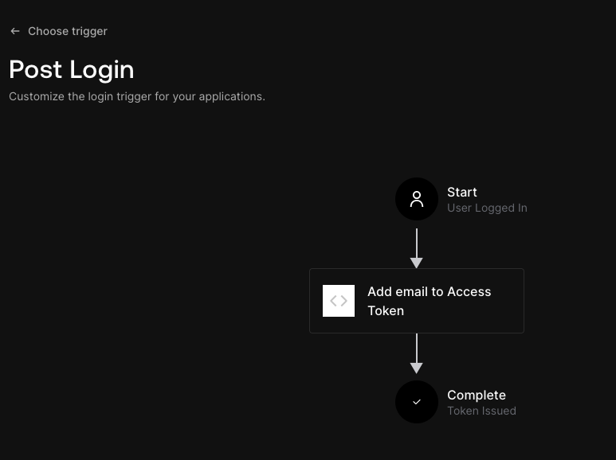

OIDC for Auth0
==============

Using Auth0 as an OIDC provider in Ontrack involves some specific setup.

# Auth0 setup

You'll need to create an API (for example: `https://nemerosa.com/ontrack`)
and link it to your Auth0 application. No specific permission or role
is needed.

The access token emitted by Auth0 does not contain the email in any claim,
and it must be added explicitly.

In your Auth0 tenant, in _Actions > Triggers_, configure the _Post login_
by adding the _Add email to access token_ predefined action. This will
look like:



This action is configured using a `NAMESPACE` value; you can set
it for example to `https://nemerosa.com/oauth2/claim` but any other value 
is fine. You'll need it later.

# Helm chart values

```yaml
ontrack:
  # Ontrack root URL
  url: https://****
auth:
  # Key used for the generation of cookies by the Next Auth frontend
  secret: <openssl rand -hex 32>
  oidc:
    # Enabling OIDC authentication
    enabled: true
    # Display name for your IdP (used for the login page)
    name: <display name for the provider>
    # OIDC issuer URL
    issuer: https://****.auth0.com
    # The issuer in Next Auth must not have a trailing slash
    # ... while the one in Spring Boot must...
    trailingSlash: true
    # Credentials used to contact the OIDC provider
    credentials:
      # Either stored in a secret (recommended)
      secret:
        # Using a secret
        enabled: true
        # The secret is expected to have the following keys: clientId & clientSecret
        secretName: <secret name>
        # Depending on your setup, you can also just create an external secret
        # definition, pointing to the actual secret in a secret provided like
        # Vault or your cloud secret manager
        # If not using an external secret, Ontrack expects you to create the 
        # secret manually.
        # externalSecret:
          # Enabling the creation of the external secret 
          # enabled: false
          # Refresh interval
          # refreshInterval: 6h
          # Location of the secret to bind to
          # store:
            # Name of the secret store
            # name: vault-backend
            # Scope of the secret store
            # kind: ClusterSecretStore
            # Path to the secret in the store.
            # The entry is expected to have the following keys: clientId & clientSecret
            # path: ontrack/oidc
      # ... or provided directly in the values (ok for testing)
      # If a secret (or external secret) is provided, these values are not used
      # clientId: <client id>
      # clientSecret: <client secret>
  keycloak:
    # Disabling Keycloak altogether
    enabled: false
  # Okta specifics: the JWT emitted by this IdP is not fully OIDC compliant
  jwt:
    # Audience
    audience: <the API identifier>
    # The email in the access token is contained in the `sub` claim
    claims:
      # For example: https://nemerosa.com/oauth2/claim/email
      email: NAMESPACE/email
```
